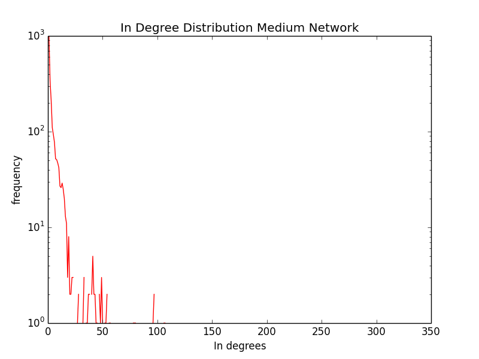
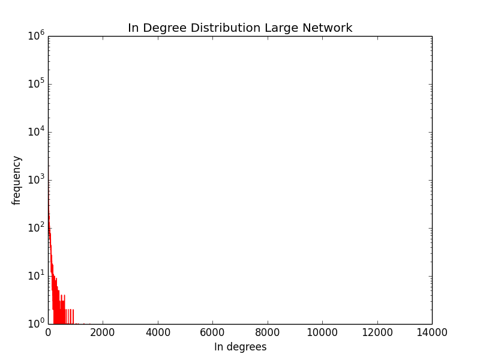
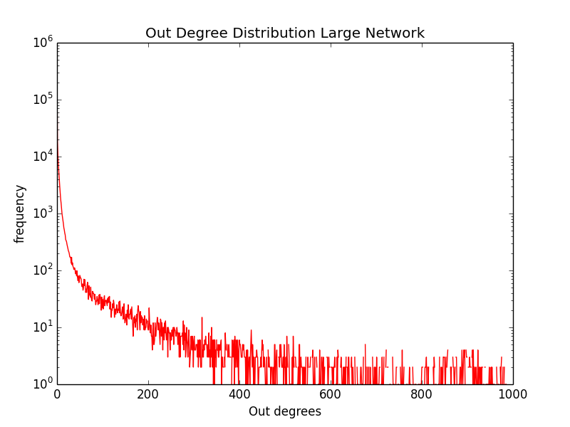
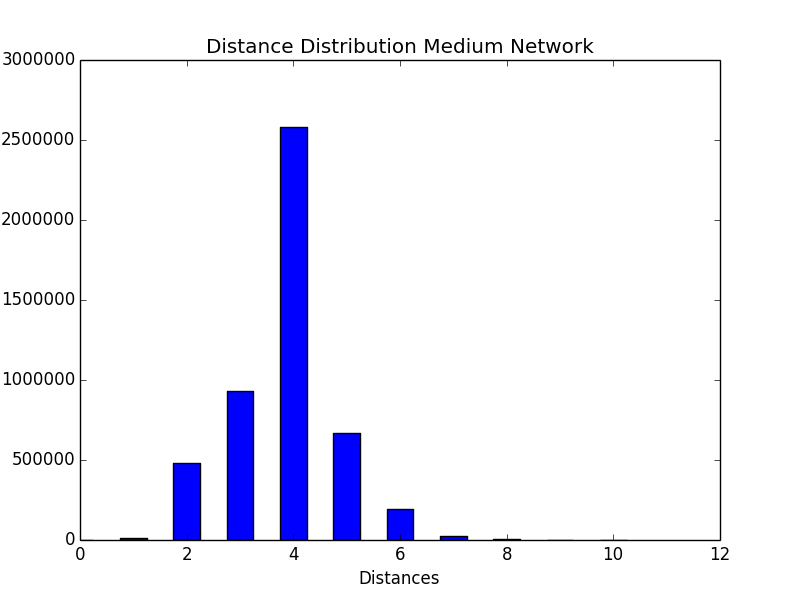
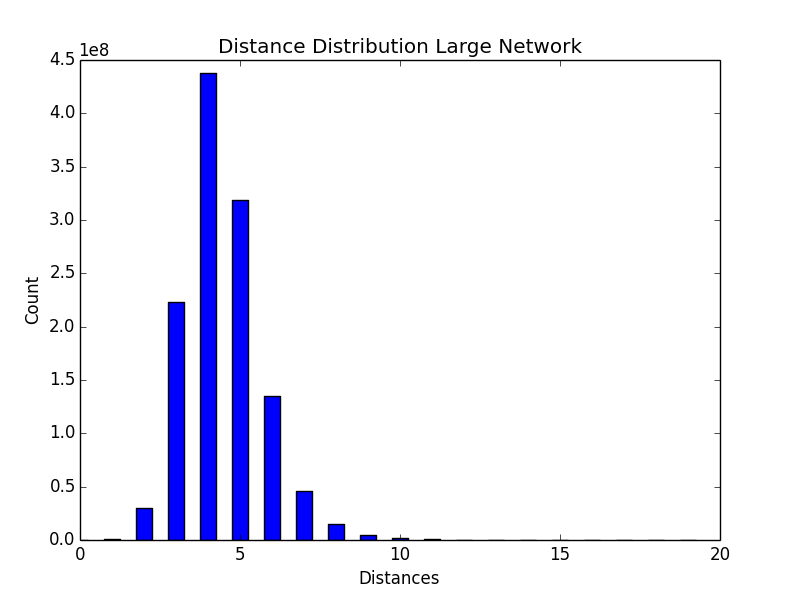
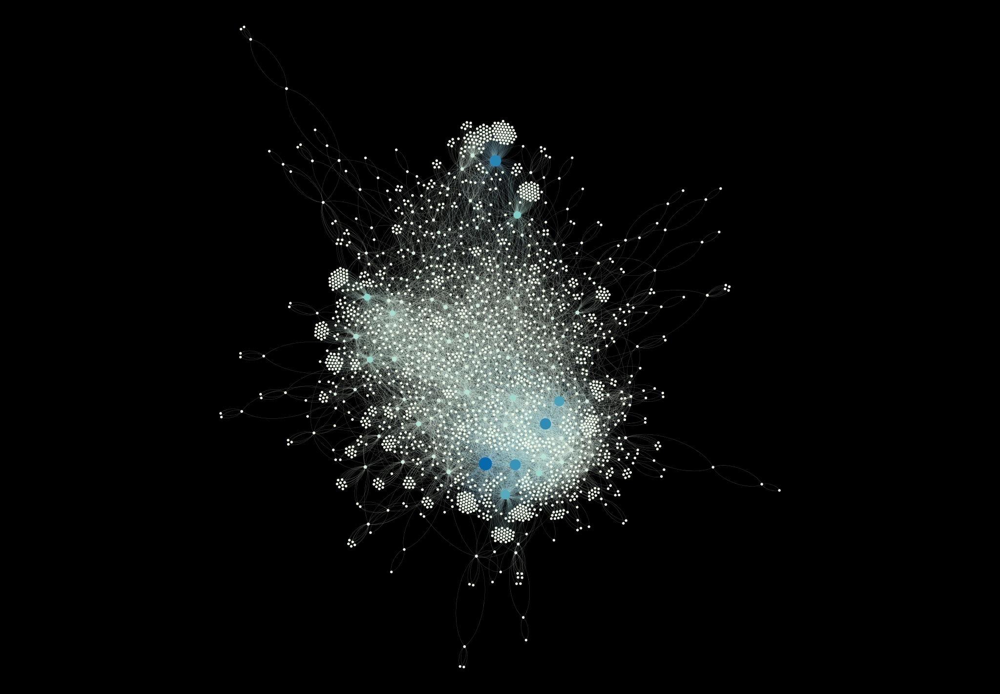

    .------.            __         __    .-----.       __                        __    
    |   ___|-----.----.|__|.---.-.|  |   |   | |-----.|  |_.--.--.--.-----.----.|  |--.
    |___   |  _  |  __||  ||  _  ||  |   |     |  -__||   _|  |  |  |  _  |   _||    < 
    |______|_____|____||__||___._||__|   |_|___|_____||____|________|_____|__|  |__|__|
    .------.             __               __            ___              .-----.------.
    |  __  |-----.---.-.|  |.--.--.-----.|__|.-----.  .'  _|.-----.----. |   __|   ___|
    |      |     |  _  ||  ||  |  |__ --||  ||__ --|  |   _||  _  |   _| |  |__|___   |
    |__||__|__|__|___._||__||___  |_____||__||_____|  |__|  |_____|__|   |_____|______|
                            |_____|                                                    
    Leiden University 2016 - 2017 // Frank Takes // Govert Brinkmann
                           

# Assignment 1
This repository contains my work for the first assignment of the Social Network Analysis for Computer Scientists of Leiden University.

## Exercise 1: Neighborhoods (40p)

### Q1.1 Give a definition of the indegree and outdegree of a node using the notion of a (reversed) neighborhood.

The indegree of node v can be expressed as the number of edges that are in the revese neighborhood (edges of the set N'(v)). 
The outdegree of node v can be expressed as the number of edges that are in the neighborhood (edges of the set N(v) ). 

### Q1.2 What do we know about nodes u, v ∈ V if for these nodes it holds that |N(u) ∩ N′(v)| > 0 ?

If this is the case we know that nodes u and v are directly connected by at least one connected edge. 

### Q1.3 Explain how the k-neighborhood Nk(W) function can be used to determine if two nodes are in the same connected component of an undirected graph.

###  Q1.4 Write down a definition of the diameter of a connected undirected graph using the notion of a k-neighborhood.

### Q1.5 The neighborhood of a node u ∈ V can easily be obtained if the underlying data structure of the network is an adjacency list: simply access node u’s list of adjacent nodes. However, querying the existence of a link (u,v) between nodes u,v ∈ V will take O(k) time, where k is u’s degree (list length). Indeed, each of the k nodes in the neighborhood of u should be checked to see if it is equal to v. Now, assume we want to answer many (say, more than n3) link queries (u,v), checking if a link exists between u and v. Explain a simple preprocessing step to speed up the O(k) time complexity of checking link existence, without using extra memory. Discuss the time complexity of your approach.

### Q1.6 A square is a path (u,v,w,x,u) such that (u,v),(v,w), (w,x),(x,u) ∈ E. Use the (k-)neighborhood function to give, either in unambiguous and precise words or using simple pseudo-code, an algorithm for counting the number of squares in a connected undirected graph with n > 3 nodes. What is the time complexity of your algorithm?

### Q1.7 Use the previous notions and algorithms to give, either in unambiguous and precise words or using simple pseudo-code, an algorithm for checking if a given undirected graph is a tree.

## Exercise 2: Mining an Online Social Network (60p)

### Q2.1 How many Directed links does this network have? | [snacs_assignment_1_Q_2_1.py](https://github.com/Jasper2-0/snacs-assignment-1/blob/master/snacs_assignment_1_Q_2_1.py)

- **Medium Network:** 12864
- **Large Network:** 1731653

        def main():
    
            DGTiny = parseEdgeFileToDiGraph(tinyFn)
            DGSmall = parseEdgeFileToDiGraph(smallFn)
            DGMedium = parseEdgeFileToDiGraph(mediumFn)
            DGLarge = parseEdgeFileToDiGraph(largeFn)
        
            ## Q2.1 How many Directed links does this network have?
            
            print "### Q2.1 How many Directed links does this network have?"
            print "Tiny Network: " + str( nx.number_of_edges(DGTiny) )
            print "Small Network: " + str( nx.number_of_edges(DGSmall) )
            print "Medium Network: " + str( nx.number_of_edges(DGMedium) )
            print "Large Network: " + str ( nx.number_of_edges(DGLarge) )

### Q2.2 How many users does this network have? | [snacs_assignment_1_Q_2_2.py](https://github.com/Jasper2-0/snacs-assignment-1/blob/master/snacs_assignment_1_Q_2_3.py)

- **Medium Network:** 2239
- **Large Network:** 279630

        def main():
        
            DGTiny = parseEdgeFileToDiGraph(tinyFn)
            DGSmall = parseEdgeFileToDiGraph(smallFn)
            DGMedium = parseEdgeFileToDiGraph(mediumFn)
            DGLarge = parseEdgeFileToDiGraph(largeFn)
        
            ## Q2.2 How many users does this social network have?
            
            print "### Q2.2 How many users does this network have?"
            print "Tiny Network: " + str( nx.number_of_nodes(DGTiny) )    
            print "Small Network: " + str( nx.number_of_nodes(DGSmall) )
            print "Medium Network: " + str( nx.number_of_nodes(DGMedium) ) 
            print "Large Network: " + str ( nx.number_of_nodes(DGLarge) )

### Q2.3 Give the indegree and outdegree distribution of this graph

#### Medium Network

##### Indegree Distribution

##### Outdegree Distribution

#### Large Network

##### Indegree Distribution

##### Outdegree Distribution

        def main():
        
            DGTiny = parseEdgeFileToDiGraph(tinyFn)
            DGSmall = parseEdgeFileToDiGraph(smallFn)
            DGMedium = parseEdgeFileToDiGraph(mediumFn)
            DGLarge = parseEdgeFileToDiGraph(largeFn)
        
            ## "### Q2.3 Give the indegree and outdegree distribution of this graph (so, for each degree value the number of times that it occurs)."
            
            print "### Q2.3 Give the indegree and outdegree distribution of this graph (so, for each degree value the number of times that it occurs).\n"
        
            tinyInDistribution = InDegreeDistribution (DGTiny)
            dump (tinyInDistribution,'pickles/Tiny_In_Degree_Distribution.pickle');
            
            tinyOutDistribution = OutDegreeDistribution (DGTiny)
            dump (tinyOutDistribution,'pickles/Tiny_Out_Degree_Distribution.pickle');
        
            SmallInDistribution = InDegreeDistribution (DGSmall)
            dump (SmallInDistribution,'pickles/Small_In_Degree_Distribution.pickle');
            
            SmallOutDistribution = OutDegreeDistribution (DGSmall)
            dump (SmallOutDistribution,'pickles/Small_Out_Degree_Distribution.pickle');
        
            MediumInDistribution = InDegreeDistribution (DGMedium)
            dump (MediumInDistribution,'pickles/Medium_In_Degree_Distribution.pickle');
            
            MediumOutDistribution = OutDegreeDistribution (DGMedium)
            dump (MediumOutDistribution,'pickles/Medium_Out_Degree_Distribution.pickle');
        
            LargeInDistribution = InDegreeDistribution (DGLarge)
            dump (LargeInDistribution,'pickles/Large_In_Degree_Distribution.pickle');
            
            LargeOutDistribution = OutDegreeDistribution (DGLarge)
            dump (LargeOutDistribution,'pickles/Large_Out_Degree_Distribution.pickle');
        
        
        def InDegreeDistribution ( DiGraph ):
            inDegrees = DiGraph.in_degree().values()
                
            InBinCount =  np.bincount(np.array(inDegrees))
            
            return InBinCount
        
        def OutDegreeDistribution ( DiGraph ):
            outDegrees = DiGraph.out_degree().values()
            OutBinCount = np.bincount(np.array(outDegrees))
            
            return OutBinCount

### Q2.4 How many weakly connected components and how many strongly connected components does this network have? How many nodes and links are in the largest strongly connected component of this graph? | [snacs_assignment_1_Q_2_4.py](https://github.com/Jasper2-0/snacs-assignment-1/blob/master/snacs_assignment_1_Q_2_4.py)

- **Number of weakly connected components Medium Network:** 9
- **Number of weakly connected components Large Network:** 6863

- **Number of strongly connected components Medium Network:** 9
- **Number of strongly connected components Large Network:** 240113

How many nodes are in the largest strongly connected component?

- **Medium Network:** 2217
- **Large Network:** 34826

How many links are in the largest strongly connected component?

- **Medium Network:** 12836
- **Large Network:** 799102

        def main():
        
            DGTiny = parseEdgeFileToDiGraph(tinyFn)
            DGSmall = parseEdgeFileToDiGraph(smallFn)
            DGMedium = parseEdgeFileToDiGraph(mediumFn)
            DGLarge = parseEdgeFileToDiGraph(largeFn)
        
            # Q2.4 How many weakly conected components and how many strongly connected components
            # does this network have? How many nodes and links are in the largest strongly connected component of this graph?
        
            print "### Q2.4 How many weakly conected components and how many strongly connected components does this network have? How many nodes and links are in the largest strongly connected component of this graph?\n"
                
            print "Number of weakly connected components Tiny : " + str ( nx.number_weakly_connected_components(DGTiny) )
            print "Number of weakly connected components Small : " + str ( nx.number_weakly_connected_components(DGSmall) )
            print "Number of weakly connected components Medium : " + str ( nx.number_weakly_connected_components(DGMedium) )
            print "Number of weakly connected components Large : " + str ( nx.number_weakly_connected_components(DGLarge) )
            print "\n"
            
            print "Number of strongly connected components Tiny: " + str (nx.number_strongly_connected_components(DGTiny) )
            print "Number of strongly connected components Small: " + str (nx.number_strongly_connected_components(DGSmall) )
            print "Number of strongly connected components Medium: " + str (nx.number_strongly_connected_components(DGMedium) )
            print "Number of strongly connected components Large: " + str (nx.number_strongly_connected_components(DGLarge) )
            print "\n"
            
            largestT = max(nx.strongly_connected_component_subgraphs(DGTiny), key=len)
            largestS = max(nx.strongly_connected_component_subgraphs(DGSmall), key=len)
            largestM = max(nx.strongly_connected_component_subgraphs(DGMedium), key=len)
            largestL = max(nx.strongly_connected_component_subgraphs(DGLarge), key=len)
            
            print "How many nodes are in the largest strongly connected component?"
            print "Tiny Network: " + str ( nx.number_of_nodes(largestT) )
            print "Small Network: " + str ( nx.number_of_nodes(largestS) )
            print "Medium Network: " + str ( nx.number_of_nodes(largestM) )
            print "Large Network: " + str ( nx.number_of_nodes(largestL) )
            print "\n"
                
            print "How many links are in the largest strongly connected component?"
            print "Tiny Network: " + str ( nx.number_of_edges(largestT) )
            print "Small Network: " + str ( nx.number_of_edges(largestS) )
            print "Medium Network: " + str ( nx.number_of_edges(largestM) )
            print "Large Network: " + str ( nx.number_of_edges(largestL) )
            print "\n"

### Q2.5 Give the exact or approximated distance distribution of the largest strongly connected component of these graphs as a diagram.

#### Distance Distribution Medium Network

#### Distance Distribution Large Network

        def main():
            
            DGTiny = parseEdgeFileToDiGraph(tinyFn)
        
            l = graph_tool.topology.label_largest_component(DGTiny)
            u = graph_tool.topology.GraphView(DGTiny,vfilt=l)
            
            dist = graph_tool.stats.distance_histogram(u);
            
            dump(dist[0],'pickles/TinyDistance_Histogram.pickle');
        
            DGSmall = parseEdgeFileToDiGraph(smallFn)
        
            l = graph_tool.topology.label_largest_component(DGSmall)
            u = graph_tool.topology.GraphView(DGSmall,vfilt=l)
            
            print(u.num_vertices());
            
            dist = graph_tool.stats.distance_histogram(u);
        
            dump(dist[0],'pickles/Small_Distance_Histogram.pickle');
            
            DGMedium = parseEdgeFileToDiGraph(mediumFn)
        
            l = graph_tool.topology.label_largest_component(DGMedium)
            u = graph_tool.topology.GraphView(DGMedium,vfilt=l)
            
            print(u.num_vertices());
            
            dist = graph_tool.stats.distance_histogram(u);
            dump(dist[0],'pickles/Medium_Distance_Histogram.pickle');
        
            DGLarge = parseEdgeFileToDiGraph(largeFn)
            
            l = graph_tool.topology.label_largest_component(DGLarge)
            u = graph_tool.topology.GraphView(DGLarge,vfilt=l)
            
            print(u.num_vertices());
            
            dist = graph_tool.stats.distance_histogram(u);
            dump(dist[0],'pickles/Large_Distance_Histogram.pickle');

### Q.2.6 Visualize medium.in

For this visualization, I generated a gephiready file which added a 'Directed' property to every edge. After importing I applied the Force Atlas 2 algorithm to the graph, after it stabilized I ran the distance metric. Using the betweenness centrality for both node size and color, I re-ran the Force Atlas 2 algorithm to create more space around the largest nodes. After this, FA2 was applied again with the 'Prevent Overlap' option which created nicely clustered nodes. Finally when rendering the final PDF / PNG I rendered the edges as curves, and lowered their opacity to 50% that way the edge density in different places of the graph was a bit more obvious to spot. However the lower opacity is only visible in the rendered PNG.

- [PDF](/gephi-output/snacs_assignment_1_Q_2_6.pdf)
- [PNG](gephi-output/snacs_assignment_1_Q_2_6.png)

## Notes on elaborations for Exercise 2

All  questions for exercise 2 were executed in Python. For each question an appropriate script was written. The scripts also take care of reading in the edgelist, and producing the appropriate (directed) network.

    ~ local$: python snacs_assignment_1_Q_2_#.py

Where # is the question number. Each script produces markdown output, that was used to write the answers to the questions above. For questions 2.3 and 2.5 there is also a snacs_assignment_1_Q_2_#_plot.py. I'm new to plotting data with matplotlib, I saved the results from my computation in a Python pickle so I could load that and plot my results. This was especially handy when computing the answers to question 2.5, since that required copious amounts of running time, so I didn't have to recompute the distance distribution every time I was tweaking my plot.

I also added an extra network; 'Tiny' it's based on the 'Toy Network' that is used in lecture presentations. It allowed me to manually verify that my scripts were producing the intended output. 

For Questions 2.1 - 2.4 I used NetworkX to answer the questions. In the case of question 2.5, computing the distance distribution for the 'Large' network with NetworkX managed to turn my Macbook Pro into a functioning remote drone (read, fans were spinning so fast they managed to lift the laptop off my desk). Joking aside, Python / NetworkX quit after a total running time of an hour with an out of memory error. So, for answering question 2.5 I switched to using Graph-Tool. It produced the shortest distance distribution after 15 mins of computation on a single core. I wasn't able to install the OpenMP enabled version of graph-tool. I'm curious how much that would speed up the computation time...
